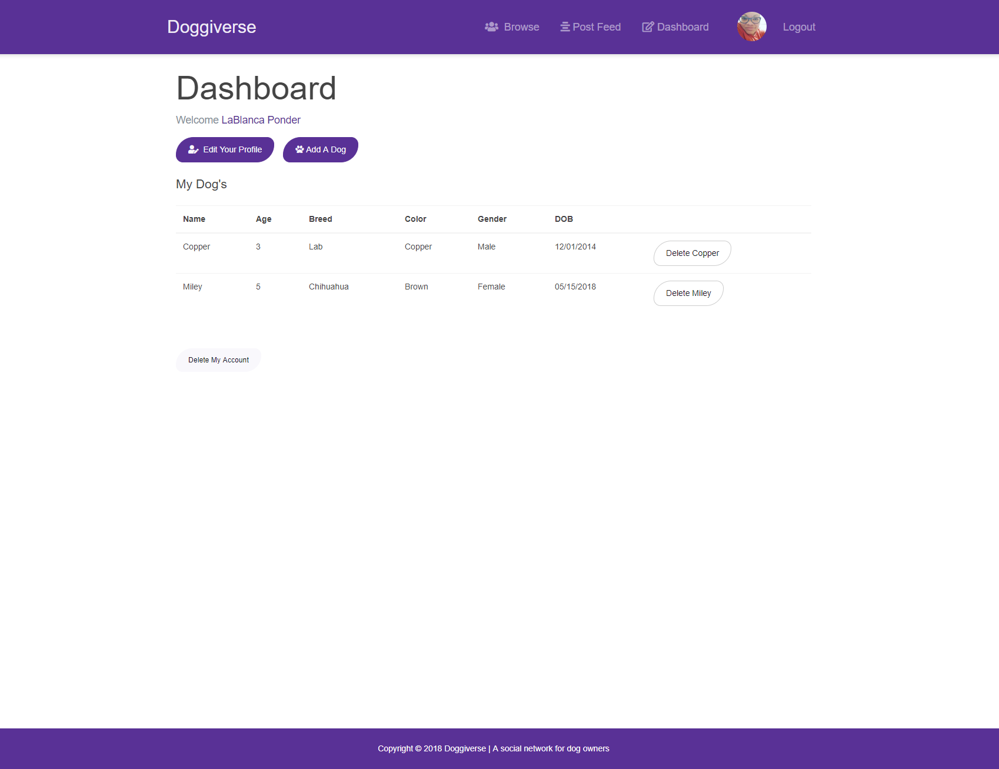

# DOGGIVERSE
### Social Network For Dog Owners

Doggiverse is a social network applications for dog owners to meet each other.  Currently, the app offers profiles for 
the owners and a timeline feed to make posts as well as comment.  

### Future Add ons

* The ability to upload images. Currently the only image(s) allowed are through Gravatar when signing up with a valid
email. This image is used for the profile only.

* Custom design.  Bootstrap was utilized for the front-end but would like to implement a custom design and css.

* Liking/Unliking posts will refresh the entire page.  Would like only the post to refresh.

* Add more social aspects like sharing, befriending and messaging.

## Heroku: https://doggiverse.herokuapp.com/

## Screenshots

## Languages/Frameworks used:

* React.js
* Node.js
* Express
* MongoDB
* Redux
* Bootstrap

